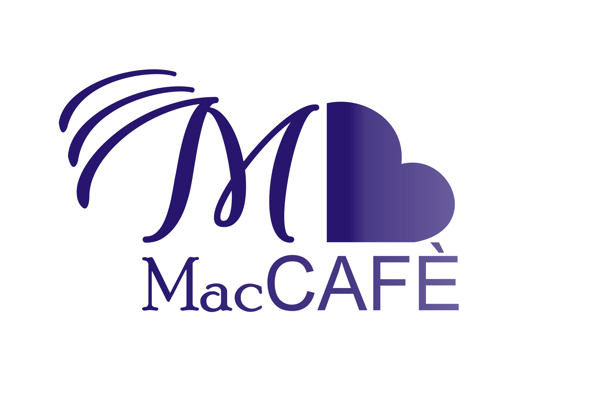
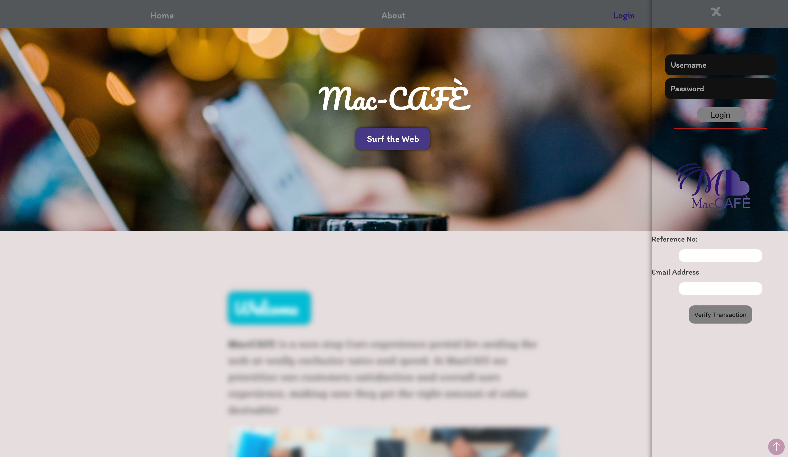

<h1 align="center">MacCAFE</h1>
<h1 align="center">This is a Webstack project focused on Internet Service Provider Web Application</h1>

    

---------
## Description

This repository contains the files to launch a **A Fully Operation Web Application** with the aid of **Webstacking**, It's

This **MacCAFE Web Application** is a project written in Python, Flask, Flask-SQLAlchmey, Javascript, Html, CSS and other DEVOPS programming language that gives the user a virtual interface well laced with critical functionalities enabling clear user access, interactions and simplicity. The **MacCAFE Web Application** is build upon clear logic and user interaction in mind. With simplicity and flexibility been the core, tackling and focusing on every day usage while cracking down cases. The overall application build is has been simplified in order to provide room for imporvement and further development, and also easy for comprehension.

## MacCAFE provides the following features:

* **app.models** - This houses the databas and generates user models
* **app.views** - This houses the blueprints for the flask framework
* **app.static** - This is the entry point for static files ranging from images, js files to swagger templates
* **app.templates** - Handles the creation of the html templates and renders them
* **app.__init__** - initializes the application
* **instance** - acts as storage for the databases
* **logs, app.log** - saves the logs of the application and monitors behavior of the application
* **migrations** - ensures migrations and all round compliant around the application

## Getting Started

Make use of: <b>requirement.txt</b> file to install the requirements and dependencies

Simply run the Bash script to initialize the flask app, migrations and databse setup: <b>./script.sh</b>

Use the: <b>create_admin.py</b> file to create the admin for the flask app

To start the flask application, Run: <b>run.py</b> to start the application on localhost with port 5001

    

### AUTHOR
*Kelvin Maccarthy* - [@Captncarty](https://github.com/Captncarty)
